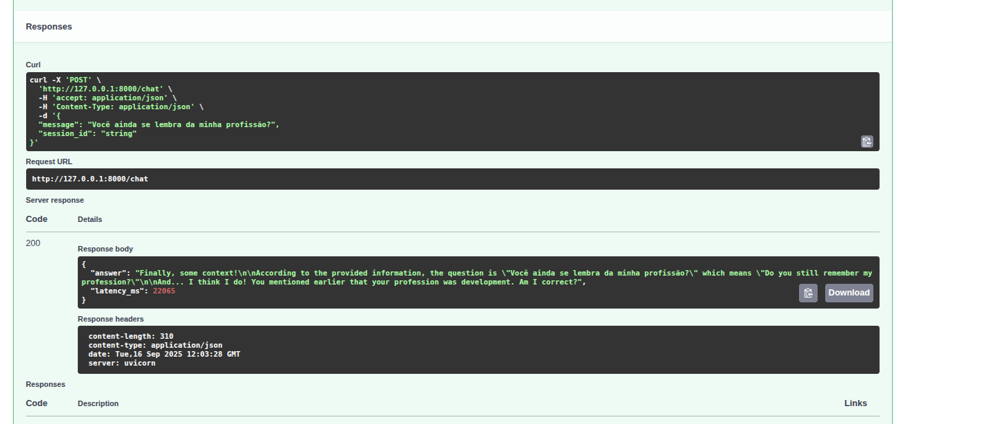
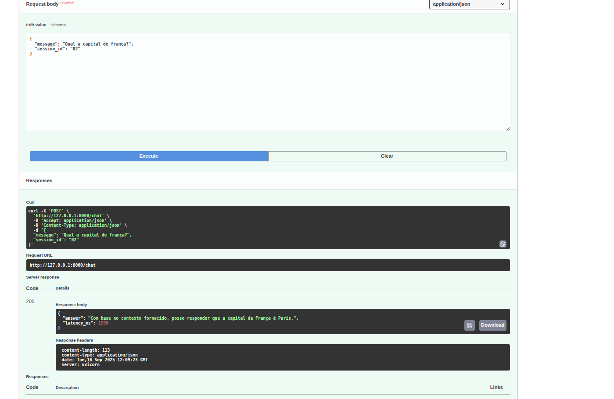
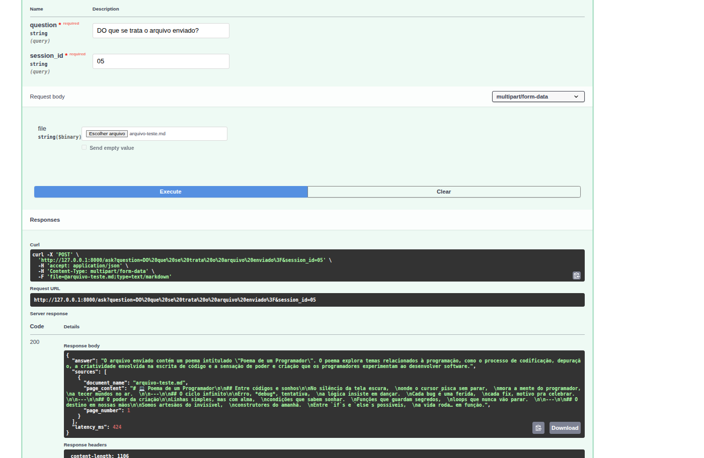

# API de Chat de Perguntas & Respostas com FastAPI e LangChain

Este projeto implementa uma API de chat de perguntas e respostas utilizando FastAPI para o backend e LangChain para a orquestração da lógica de IA.

## Como Rodar o Projeto Localmente

Siga os passos abaixo para configurar e executar o projeto em sua máquina local.

### 1. Pré-requisitos

Certifique-se de ter o Python 3.9+ e `pip` instalados.

### 2. Configuração do Ambiente Virtual

Crie um ambiente virtual para isolar as dependências do projeto:

```bash
python -m venv .venv
source venv/bin/activate  # No Linux/macOS
# .venv\Scripts\activate   # No Windows
```

### 3. Instalação das Dependências

Primeiro, clone o repositório (se ainda não o fez) e navegue até o diretório do projeto:

```bash
git clone https://github.com/corteisjr/Chatbot.git
cd Chatbot
```

Instale as dependências do projeto usando `pip`:

```bash
pip install -r requirements.txt
```

### 4. Configuração das Variáveis de Ambiente

Crie um arquivo `.env` na raiz do projeto, baseado no arquivo `.env.example`. Este arquivo conterá as variáveis de ambiente necessárias para a aplicação

```bash
cp .env.example .env
```

Edite o arquivo `.env` e preencha com suas credenciais e configurações (ex: chaves de API para serviços de IA, etc.).

### 5. Executando a Aplicação

Para iniciar o servidor FastAPI, execute o seguinte comando na raiz do projeto:

```bash
uvicorn app.main:app --reload
```

A API estará disponível em `http://127.0.0.1:8000`. Você pode acessar a documentação interativa da API (Swagger UI) em `http://127.0.0.1:8000/docs`.

### 5.1. Executando com Ollama (Opcional)

1.  **Instale o Ollama:** Certifique-se de ter o Ollama instalado e em execução em sua máquina. Você pode baixá-lo em [ollama.ai](https://ollama.ai/).

2.  **Baixe um Modelo:** Use o comando `ollama pull` para baixar o modelo de sua escolha (ex: `ollama pull llama3`).
3.  **Rode o servidor de ollam:** Use o comando  `ollama serve`

4.  **Configure o `.env`:** No seu arquivo `.env`, defina as variáveis necessárias para apontar para o seu modelo Ollama. Por exemplo:

    ```
    OLLAMA_MODEL=llama3
    ```

5.  **Inicie a Aplicação:** Execute a aplicação

    ```bash
    uvicorn app.main:app --reload
    ```


### Imagens dos Testes




#### Usando Arquivos

